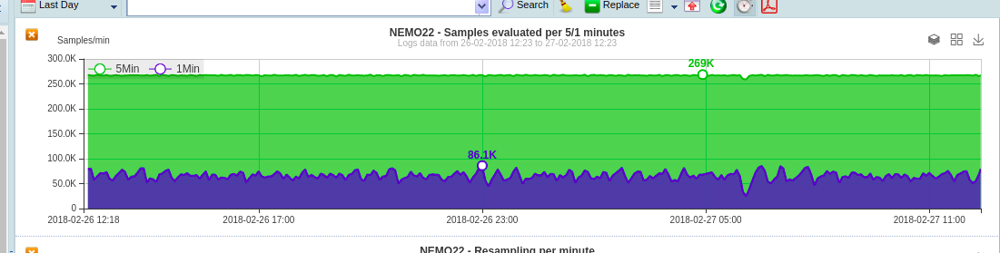

.. _h6a743b5b106c492a78f144c4376398:

Ne.Mo. Network Monitoring Tool

*******************************

.. _hb79795d3e46b47696c7c5b6d3a41e:

Introduction
============

This section describe the main features of Ne.Mo Network Monitoring Tool.

If you do not find the information you are looking for please write to support@nemosupport.com and we'll fill the gap as soon as possible.

\ |IMG1|\ 

.. _h7c2856e31346c6c7732740396a6867:

Installation
************

.. _h63e56602235218b7840a7c4c193b:

Hardware and software requirements
==================================

The minimum requirements to install Ne.Mo. are:

* CentOS 6.5 x86_64bit Operating System

* CPU Intel Pentium IV 2.4Ghz

* Ram: minimum 2GB.

* Hard Disk: minimum 3 Gbyte for the software and additional space for data retention

In the previous situation, the system can manage up to 20.000 collected entities (charts) polling them every 5 minutes.

.. bottom of content

